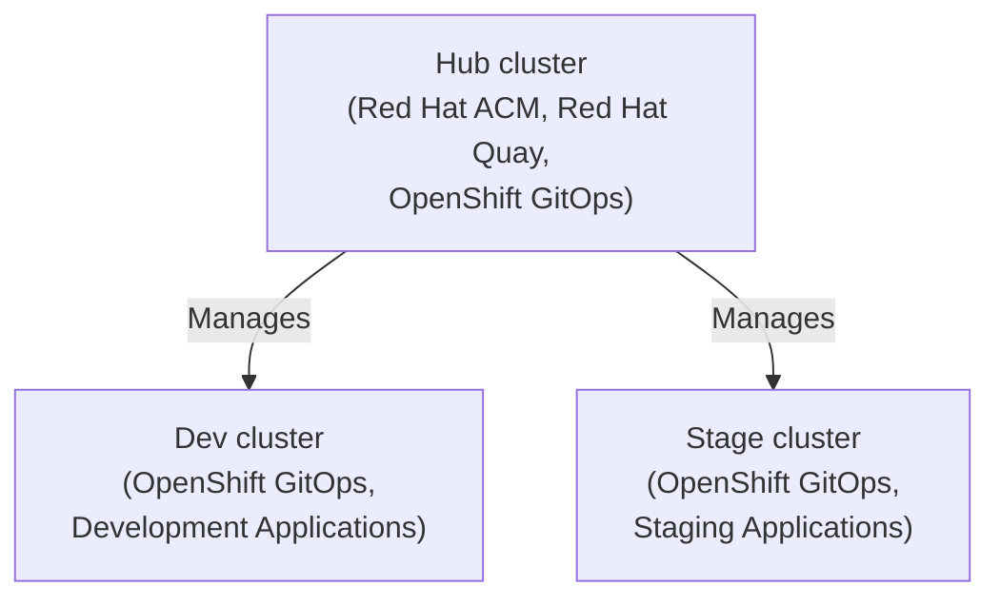
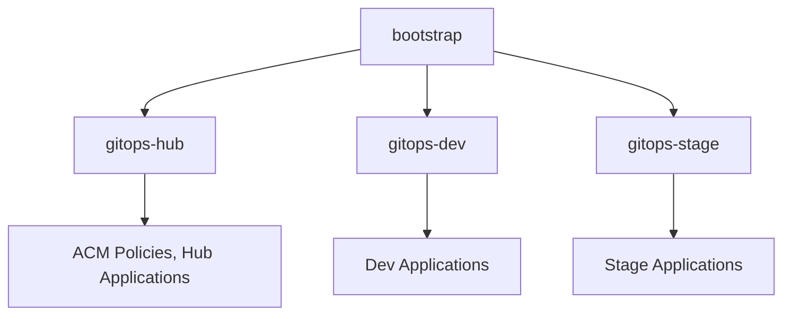

# Hello World: GitOps

This organization contains an end-to-end GitOps reference architecture for an **Everything-as-Code** fleet of Red Hat OpenShift clusters. The repos in this org demonstrate how your code repositories can be composed and used. **This is not a one-solution-fits-all architecture.** This is a reference architecture you can review and either fork the repos to your create your own, or reference pieces of the architecture as your create your own.

Hello World GitOps uses the following products:

* Red Hat OpenShift Container Platform
* Red Hat Advanced Cluster Management for Kubernetes
* Red Hat Quay
* Red Hat OpenShift GitOps (Argo CD)

The reference architecture has 3 clusters: Hub, Dev, and Stage. ACM and Quay are deployed to Hub. Dev hosts development applications. Stage hosts staging applications.

**Note:** To keep this project smaller, I elected to only feature a dev and stage environment. Additional environments could be added by creating additional clusters and copying either the dev or stage resources.

## Hierarchy

### Clusters

### Repos

## Layout

Each repository under the hello-world-gitops organization tackles a different piece of the GitOps puzzle.

- bootstrap
    - Bootstraps the Red Hat OpenShift multi-cluster fleet using Red Hat Advanced Cluster Management (ACM)
- policy
    - Red Hat Advanced Cluster Management (ACM) policies supporting the hello-world-gitops fleet
- gitops-hub
    - OpenShift GitOps (Argo CD) configurations to deploy applications on the Hub cluster
- gitops-dev
    - OpenShift GitOps (Argo CD) configurations to deploy applications on the Dev cluster
- gitops-stage
    - OpenShift GitOps (Argo CD) configurations to deploy applications on the Stage cluster
- app-1-helm
    - Code to deploy hello-world application
- app-1-code
    - Code to build the hello-world application container image

**All repos in the hello-world-gitops org are subject to change. Do not point your deployments to these repos.** If you want to take any pieces of hello-world-gitops, fork the repos and deploy those.

## Prerequisites

To deploy, you will need 3 OpenShift clusters. There is too much variability in OpenShift installation between different platforms to include in this project so it’s BYOC (bring your own clusters).

The clusters can be standard 5+ node clusters, hyper-converged 3 node clusters, or single-node OpenShift (SNO) clusters.

Designate the role for each cluster: hub, dev, and stage.

- Install ACM on the hub cluster through OperatorHub. - Create a multi-cluster hub (operator install walks you through this).
- Import (or create) the other two clusters in ACM

At this stage you should have 3 clusters: hub, dev, and stage. The hub cluster should have ACM installed and should be managing the other two clusters. 

### Deploying

- Log into the hub cluster with `oc`
- Clone the bootstrap repo
- Run `make install`

The bootstrap repo will create ACM applications for policy, gitops-hub, gitops-dev, and gitops-stage. Policies will be deployed and enforced on the managed clusters. The Argo CD resources deployed by the gitops repos will deploy applications through OpenShift GitOps on each of the clusters.
