This organization contains an end-to-end, **Everything-as-Code** reference architecture for multi-cluster management of Red Hat OpenShift.
The repos in this org are meant to demonstrate how an organization can manage their code repositories to support a GitOps deployment pattern for cluster configurations and applications.

**This is not a one-solution-fits-all architecture.**

This is a reference architecture you can review and either fork the repos or reference pieces of the architecture as your create your own solution.

**The reference architecture does not include deployment of OpenShift onto any platform.**

Everything in this organization for day 2, post-install configuration and management of all OpenShift clusters.

## Architecture Breakdown

The reference architecture uses the following products:

* [Red Hat OpenShift Container Platform]
* [Red Hat Advanced Cluster Management (ACM) for Kubernetes]
* [Red Hat OpenShift GitOps (Argo CD)]

The reference architecture has 3 OpenShift clusters: Dev, Stage, and Hub.
Dev and Stage host development and staging applications respectively.
Hub hosts ACM and manages the Dev and Stage clusters.
Additionally, Hub should be used to host other shared applications (artifact registry, container registry, secret server, etc.).

**NOTE:** To keep this project smaller, I elected to only feature a dev and stage environment.
Additional environments can be implemented following the same pattern that dev and stage use.

**All cluster and application configuration is be managed as code in Git repositories stored in a central Git server (GitHub, GitLab, etc.).**

OpenShift GitOps is deployed to all three clusters.
Applications are deployed to the clusters through the default cluster-wide Argo CD instance that OpenShift GitOps provides.
The Argo CD AppProject and Application configurations for all applications in a given cluster are stored in the *gitops-clustername* repo.
For example, the configuration to deploy all development applications is in the *gitops-dev* repo.

The GitOps repo for each cluster is deployed by ACM from the Hub cluster.

```mermaid
graph TD
	Admin["Admin 🧑‍💻"]
	ACM["Red Hat Advanced Cluster<br />Mangement (ACM) for Kubernetes"]

	subgraph stage [Stage OpenShift Cluster]
	GitOpsStage["OpenShift GitOps<br />(Argo CD)"]
	StageApplications["Staging Applications"]
	end

	subgraph hub [Hub Openshift Cluster]
	ACM
	GitOpsHub["OpenShift GitOps<br />(Argo CD)"]
	SharedApplications["Shared Applications"]
	end

	subgraph dev [Dev OpenShift Cluster]
	GitOpsDev["OpenShift GitOps<br />(Argo CD)"]
	DevApplications["Development Applications"]
	end

	Admin -. "Manually deploys 'bootstrap' repo<br />(This only happens once, everything<br />past this point is automated)" .-> ACM

	ACM -- "Continously deploys<br />'gitops-hub' repo" --> GitOpsHub
	GitOpsHub -- "Continously deploys<br />application repos" --> SharedApplications

	ACM -- "Continously deploys<br />'gitops-dev' repo" --> GitOpsDev
	GitOpsDev -- "Continously deploys<br />application repos" --> DevApplications

	ACM -- "Continously deploys<br />'gitops-stage' repo" --> GitOpsStage
	GitOpsStage -- "Continously deploys<br />application repos" --> StageApplications
```

## Git Repositories

All repositories under this organization support the reference architecture.

**NOTE: All repos under this organization are subject to change.
Do not point your deployments to these repos!**
If you want to use any code in these repos, fork the repos and deploy those to your clusters.

### Bootstrap

- [bootstrap]
    - Bootstrap multi-cluster management of Red Hat OpenShift through Red Hat Advanced Cluster Management (ACM) for Kubernetes

### Per-Cluster GitOps (Argo CD) Configurations

- [gitops-dev]
    - OpenShift GitOps (Argo CD) configurations to deploy applications on the Dev cluster
- [gitops-hub]
    - OpenShift GitOps (Argo CD) configurations to deploy applications on the Hub cluster
- [gitops-stage]
    - OpenShift GitOps (Argo CD) configurations to deploy applications on the Stage cluster

### ACM Governance Policy

- [policy]
    - Red Hat Advanced Cluster Management (ACM) for Kubernetes governance policies for all clusters

### Example Application

- [theme-park-api-chart]
    - Helm chart to deploy an example REST API. This is deployed to the dev and stage environments through OpenShift GitOps (Argo CD).

## Deploying

**I don't expect anyone to actually deploy this from GitHub.**

These repos exist to demonstrate how to configure multi-cluster management of OpenShift clusters using the GitOps pattern.
I would recommend taking a look at the repos individually and adding pieces from them into your solution as needed.
If you're at square one and need a place to start, feel free clone the repos in this org and use the reference architecture as is.

To deploy, you will need 3 OpenShift clusters.
I use Single-Node OpenShift (SNO) deployments to test things out.

Install ACM on the Hub cluster and import the other two clusters (or create the clusters from ACM, your call 🤷.
Make sure the clusters are named `dev` and `stage` in ACM.
(The hub cluster in ACM will always be called `local-cluster`.)

- Log into the hub cluster with `oc`
- Clone the bootstrap repo
- Run `make install`

The bootstrap repo will create the necessary ACM subscriptions, which will create Argo projects on the clusters, which will deploy applications!

## FAQ

### Will this architecture work for an organization that scales across multiple clusters per environment?

Redundant, geographically distributed environments could be implemented following a similar pattern to dev/stage.
For example, if an organization has an east and west cluster for their stage environment, the resources for stage in this reference architecture could be duplicated as *stage-east* and *stage-west*.

This architecture may not be feasible for a large number of clusters per environment due to the amount of configuration required.
For example, if an organization has 400 edge clusters for their stage environment, they would need to manage 400 GitOps (Argo configuration) repos.

[Red Hat Advanced Cluster Management (ACM) for Kubernetes]: https://www.redhat.com/en/technologies/management/advanced-cluster-management
[Red Hat OpenShift Container Platform]: https://docs.openshift.com/container-platform/latest
[Red Hat OpenShift GitOps (Argo CD)]: https://docs.openshift.com/container-platform/latest/cicd/gitops/gitops-release-notes.html
[bootstrap]: https://github.com/hello-openshift-multicluster-gitops/bootstrap
[gitops-dev]: https://github.com/hello-openshift-multicluster-gitops/gitops-dev
[gitops-hub]: https://github.com/hello-openshift-multicluster-gitops/gitops-hub
[gitops-stage]: https://github.com/hello-openshift-multicluster-gitops/gitops-stage
[policy]: https://github.com/hello-openshift-multicluster-gitops/policy
[theme-park-api-chart]: https://github.com/hello-openshift-multicluster-gitops/theme-park-api-chart
